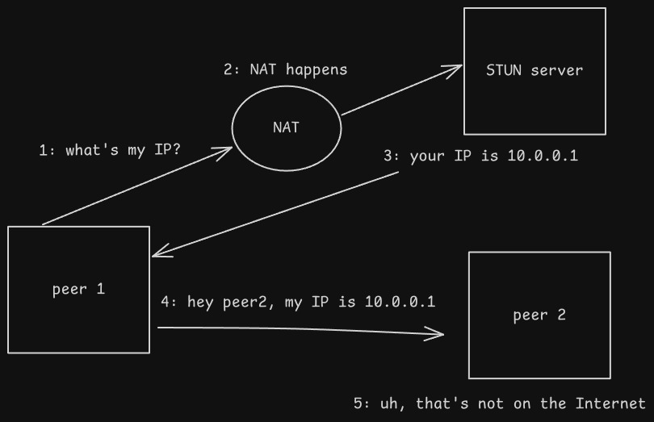

NetBird is a VPN solution built on WireGuard that implements some nice authentication and access control features. Until now I've been using a barebones WireGuard VPN, but today I felt like tinkering, so here we are.

NetBird makes use of ICE, STUN, and TURN. I had not heard of these before, so it's time for a short detour before we get started.

## NAT Traversal

STUN, TURN, and ICE are basically protocols for establishing a connection between two endpoints, which almost always involves NAT traversal. They are primarily employed in [WebRTC](https://en.wikipedia.org/wiki/WebRTC).

[ICE](https://en.wikipedia.org/wiki/Interactive_Connectivity_Establishment) is a technique that uses STUN and TURN to attempt to find the best way to form a direct connection between two peers.

STUN is a protocol for establishing direct UDP connections between two clients. A server on the Internet receives a request from a client, and tells the client what its public IP seem to be from the server's perspective; the client can then send that to a peer for a direct connection.

TURN is an extension of STUN. There are two major limitations inherent to STUN that are solved by TURN:
- It is UDP only. What do we do if we can't establish a UDP connection with our peer?
- The public IP seen by the STUN server may be different from the public IP seen by the desired peer, thanks to NAT.



I'll skip the details here, but [this is a good post](https://developer.liveswitch.io/liveswitch-server/guides/what-are-stun-turn-and-ice.html) to learn more.

It should be clear how these protocols are useful for a VPN server; it is capable of letting devices establish a peer-to-peer connection, without traffic needing to pass through the server. It's also handy for establishing VPN connections in a restrictive network that we don't control.

## Identity Providers (IdPs)

An identity provider is the thing that enables Single Sign-On (SSO), or using one 'account' (really, an identity) to be able to access multiple services.

IdPs make managing and auditing users and their access much simpler. NetBird integrates with an IdP to allow users to sign into the VPN and services.


- From *[How NetBird Works](https://docs.netbird.io/about-netbird/how-netbird-works)*
## Prep
### Virtual Machine
I will be using an Ubuntu Server VM to host everything. Nothing special is required; you just need at least 2GB of RAM. Once the VM is created, there some things we need to do in OPNsense.

First, I'll set a permanent DHCP lease for this host. There would be nothing stopping me from just using a temporary one, but I prefer to give server hosts static IPs that will never change.


Before doing anything else, I am going to create a category for any firewall rules related to NetBird.


Next I'll head into `Firewall > Aliases` and create a host alias for this IP.


### DNS Records
This VM needs to be reachable via the Internet. I use OPNsense's Caddy plugin for dynamic DNS, so I don't need to go into my DNS provider at all; I just go to `Services > Caddy > Reverse Proxy` and create a new subdomain.


When I apply the change, Caddy will automatically create the DNS records for me at my provider via their API. It then will check my current public IP once every 5 minutes and update the DNS records if anything has changed.

I will also create an A record in Unbound, my DNS server of choice, for `netbird.hnolan.ca`. If the DNS query is coming from the LAN, we can just resolve it locally as the VM's IP.


### Ports
Our VM also needs various ports to be forwarded. The easiest way to this is to head back to `Firewall > Alias` and create two new port aliases, one for the TCP ports and one for UDP.


Now, we need to forward these ports in `Firewall > NAT > Port Forward`.


# Initial installation and configuration

Now, on the Ubuntu VM we need to install jq, curl, and Docker. Then we run:
```
export NETBIRD_DOMAIN=your_domain.ca

curl -sSLO https://github.com/netbirdio/netbird/releases/latest/download/getting-started-with-zitadel.sh

bash getting-started-with-zitadel
```

This will set up NetBird with [Zitadel](https://zitadel.com/) as the IdP. If you already use a different IdP, see the guide [here](https://docs.netbird.io/selfhosted/selfhosted-guide). ==LINK==

When the installation finishes, you will see
```
You can access the NetBird dashboard at https://netbird.your_domain.ca
Login with the following credentials:
Username: admin@netbird.your_domain.ca
Password: ......
```

Now, head over to the web UI and sign in with the credentials output as shown above. You will be asked to set up MFA and change the password once you sign in.

The documentation references an onboarding guide that you don't get in the selfhosted version, but you can still mostly follow it.

First, we need to create a Setup Key. Copy it into a file because you will need it for the OPNsense plugin.


Then we create a network for your LAN, and a resource inside that network for our LAN subnet.


Now, I'd rather log in with a user other than the default admin one. To create a new user, we need to first go to the Zitadel web UI at  `netbird.your_domain.ca/ui/console` and log in with our admin account credentials. Then, we navigate to the Users tab and create a new user.

Because we did not set up SMTP beforehand, we won't be able to follow the normal email registration, which is fine - but we can set up SMTP to allow users to register via email if desired.


Now go back to the NetBird UI in and sign in as the new user (if you don't sign into NetBird, the user won't show in the NetBird UI). By default, our user will not have many permissions, so log out and back into the admin account.

I will my user's role to Admin so I can use it rather than the actual admin account. After, we'll click on the user to see their details and create a new group called "Users".


Next, we will create an access policy so that authenticated users can access our LAN subnet, from the `Access Control > Policies` menu.


Now, we could technically connect peers to our LAN already with this setup, but we wouldn't have working DNS. So, we need to go to `DNS > Nameservers` and configure a DNS provider. I am Canadian, so I use CIRA's free DNS service.


I will also be creating a second nameserver to resolve my LAN DNS records. For instance, I'd like to be able to SSH into my desktop with `ssh desk`, which requires `desk.hnolan.ca` to resolve.

For this, I set the nameserver IP to OPNsense's LAN IP, which is running Unbound to resolve these names.


Then set the match domain:


# Configuring Clients
## OPNsense Plugin

My router runs OPNsense and I'd like it to be the gateway into my LAN for all VPN clients. I don't want to have to set up NetBird on every single host n my LAN for point to point connections.

At first, I couldn't tell if there was OPNsense/BSD support; neither show as options in the GUI. However, I was able to find [this pull request](https://github.com/netbirdio/docs/pull/404/files) giving the documentation to set up the NetBird OPNsense plugin. First I had to switch OPNsense to the development branch and perform a few updates, but once updated to 26.1.a_83, I was able to install the `os-netbird` plugin like any other OPNsense plugin.


However, this is where I ran into a hiccup. I could not get the NetBird service to start; there were no errors in the log, just nothing happening at all. I was able to find [the relevant GitHub issue](https://github.com/opnsense/plugins/issues/4853) and saw that a [fix](https://github.com/opnsense/plugins/pull/4855) had been merged already, but I guess it's not in the latest dev release yet at the time of writing, so I had to apply the change myself. Thankfully it was just changing one line in  `/usr/local/opnsense/service/templates/OPNsense/NetBird/netbird` and running `configctl template reload OPNsense/NetBird` to regenerate the template. After this, it launched without issue. We can now go to `VPN > NetBird > Settings` and enable NetBird; then `VPN > NetBird > Authentication` to paste in our Setup Key and management URL. The connection should succeed.

We now have a new `wt0` interface for NetBird. Go to `Interfaces > Assignments` and make sure the interface is assigned.


Finally, go to `Firewall > Rules > NetBird` and create a rule to allow inbound NetBird traffic.


## Client Access

Next, I installed NetBird on my laptop and connected from an external network, which worked properly. Nothing special here, just run the commands that NetBird gives you and sign in.

Now everything pretty much works, but if you're like me you have ACLs set up for your internal services. After all, if they're internal, they should only be being accessed by RFC1918 IPs. Our NetBird overlay subnet is not RFC1918 and we have [no way to control it](https://github.com/netbirdio/netbird/issues/1617), so we need to include it in our ACL(s).

I use Caddy on OPNsense to reverse proxy all of the connections, so controlling access is very easy.


Now everything works!

# Thoughts on NetBird

Overall I really like NetBird. Setting it up was easy, I like the UI, and I like that I now have an IdP-enabled VPN. However, one thing that I didn't realize before embarking on this process is that many of the features that I'm interested in are not available in the self-hosted version. This [includes](https://docs.netbird.io/selfhosted/self-hosted-vs-cloud-netbird):
- Provisioning users/groups from the IdP
- Logging traffic
- Streaming events to SIEM
- EDR integration
- User invites

These were the features that made my eyes water when I first learned about NetBird, and it sucks to learn that I won't be able to use them. I would be fine with paying for a license for these features, but they simply aren't available at all on the self-hosted version.

Of course, that isn't going to prevent me from doing these things. It will just take extra manual work on my part - so stay tuned for the next post, I guess.
