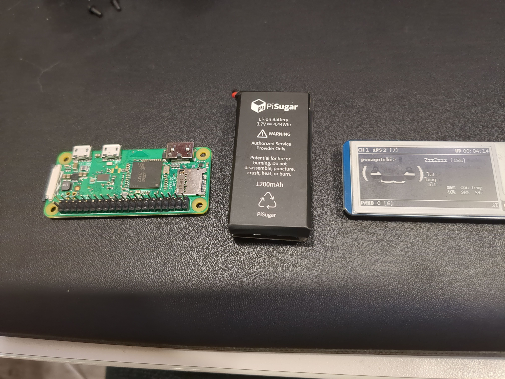
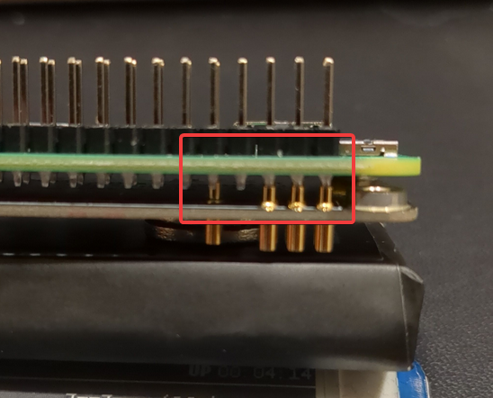
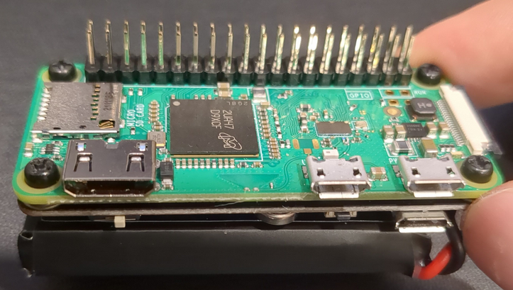
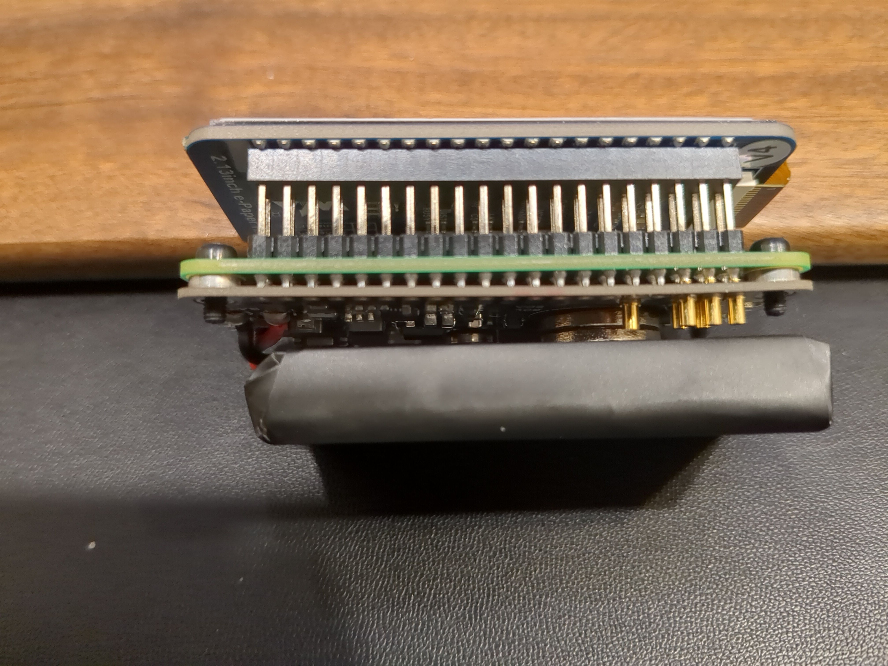
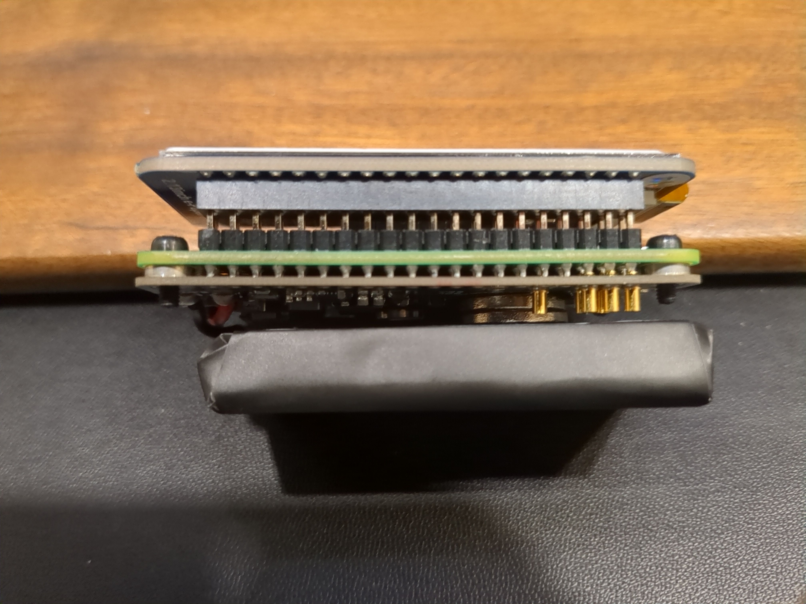
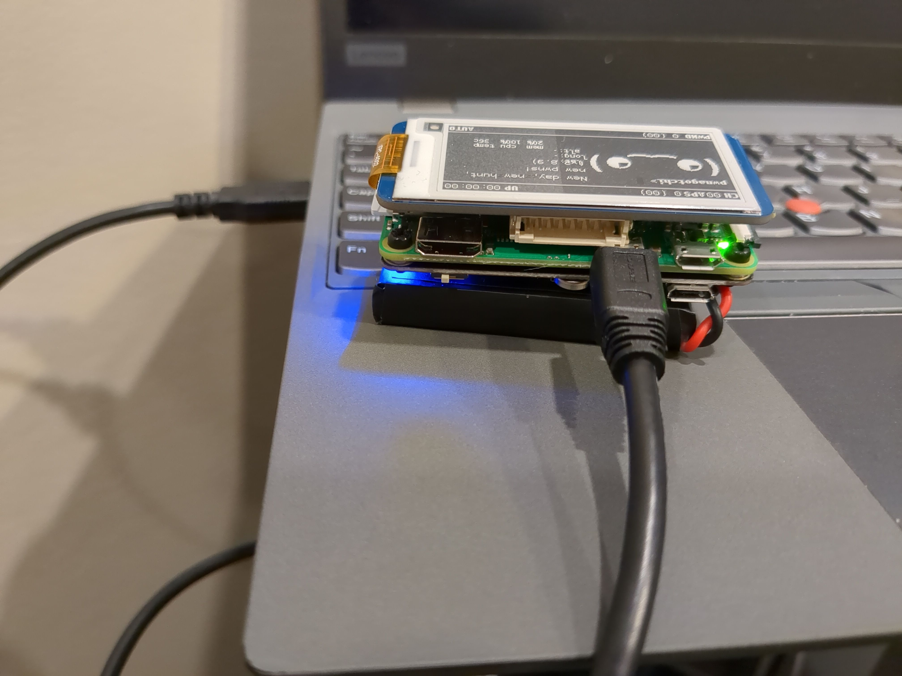
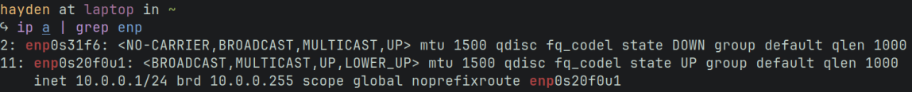

+++
date = '2024-03-30T14:25:55-04:00'
draft = false
title = 'Pwnagotchi 101'
+++

Pwnagotchi is a neat little tool that you carry around with you as it captures WPA handshakes, which can later be cracked to recover the password. I decided I wanted to build one and learn more about WPA and its security flaws, and that's what I'll cover in this post.
<!--more-->

To avoid having to type "pwnagotchi" a bunch of times, from hereon I'll refer to it as "pwny."

Note: the creator of Pwnagotchi is a controversial figure and this post is not an endorsement of them as an individual or any of their beliefs. Nonetheless, the Pwnagotchi project is interesting from a technical perspective.

## Requirements
This isn't really a guide, but if you want to follow along on your own, here is what you will need:

- A Raspberry Pi Zero W (if you want to avoid soldering, get a "WH" model which comes with the headers pre-soldered on)
- A PiSugar2 portable battery - [link](https://www.amazon.ca/dp/B08D678XPR?psc=1)
- A Waveshare 2.13 inch E-Paper display (v4) - [link](https://www.amazon.ca/dp/B0BFQGN6X4?psc=1)
- Any decent microSD card that is at least 8Gb
- A microUSB cable capable of carrying data
- Case for the pwny. This is technically optional - at the time of writing this, mine hasn't arrived yet. There are tons you can find on Amazon, Etsy, Ebay, etc. I bought [this one](https://www.etsy.com/ca/listing/1579276368/pwnagotchi-3d-printed-case-many-styles).
- A bare-metal Linux installation (you can use Windows or MacOS, but they are not covered in this post)

## So what *is* a pwny really?
From the GitHub repo:
> *Pwnagotchi is an A2C-based "AI" leveraging bettercap that learns from its surrounding Wi-Fi environment to maximize the crackable WPA key material it captures (either passively, or by performing authentication and association attacks). This material is collected as PCAP files containing any form of handshake supported by hashcat, including PMKIDs, full and half WPA handshakes.*

- **A2C**: The Advantage-Actor-Critic reinforcement learning model. The [linked tutorial](https://hackernoon.com/intuitive-rl-intro-to-advantage-actor-critic-a2c-4ff545978752) does a far better job describing it than I could, but here's the gist:

  RL models are trying to maximize their reward - to conceptualize the reward, just imagine a points system where good decisions are awarded more points than bad ones. A2C is made up of two components, the Actor and the Critic.

  The job of the Actor is to predict the outcomes for all possible actions in the current state and perform the "best" one (the action that maximizes the total reward).

  The Critic reflects upon the actions taken by the Actor and calculates how "good" the actions were. You can think of it like the Critic telling the Actor, "you have performed 5 actions and received 10 points. Our prediction was for you to have 20 points after 5 actions, so you are not making the most optimal choices."

  By calculating the difference in the expected outcome vs. the actual outcome based on the actions performed by the model, it is able to improve its performance over time.

- **[Bettercap](https://www.bettercap.org/)**: "The Swiss Army knife for WiFi, Bluetooth [...], and MITM attacks." It's a little bit like Metasploit for wireless attacks, complete with a slick web-UI. It's a very interesting project that I'll definitely be working more with, even outside of the pwny.

So basically we have an RL model using Bettercap to grab WPA handshakes, and over time it'll get better at grabbing these handshakes. I'll talk more about how the actual attacks work later in the post.

### How does it actually get better at capturing?
- The Pwny's core algorithm can be summarized as:
```python
# main loop
while True:
    # ask bettercap for all visible access points and their clients
    aps = get_all_visible_access_points()
    # loop each AP
    for ap in aps:
        # send an association frame in order to grab the PMKID
        send_assoc(ap)
        # loop each client station of the AP
        for client in ap.clients:
            # deauthenticate the client to get its half or full handshake
            deauthenticate(client)
    wait_for_loot()
```
- [Source](https://pwnagotchi.ai/usage/#training-the-ai)

There are a number of parameters used by the algorithm, which can be found in your `config.toml`. These parameters are adjusted by the AI to get the most reward from the current situation. For instance, if the Pwny is moving around, the AI might make the timeouts and RSSI thresholds smaller, so out-of-range devices are removed more quickly.

Each iteration of the main loop is an epoch. After each epoch, a score representing how well the parameters performed, known as the *reward*, is computed by [reward.py](https://github.com/evilsocket/pwnagotchi/blob/master/pwnagotchi/ai/reward.py). Over time, the AI learns which parameters perform well for any given situation, and tries to change the parameters to maximize the reward value.


## Build Process
### Preparing the SD Card
The first important thing to note is that the official guide at [https://pwnagotchi.ai](https://pwnagotchi.ai) is outdated. If you follow it, your pwny will not be functional - trust me, I tried. First of all, the official Pwnagotchi repo is no longer maintained by the creator and is years old at this point. The current generation of Waveshare displays are not compatible with this repo without adding the relevant dependencies. Instead of figuring that out yourself, use jayofelony's updated, community-run repo [here](https://github.com/jayofelony/pwnagotchi). You can still follow the official guide, but use the image from jayofelony's repo, not the official one.

Start by [downloading the latest OS image release](https://github.com/jayofelony/pwnagotchi/releases). Extract it, then flash it to your SD card. You can use any imaging tool you like, but I prefer [Rufus](https://rufus.ie/en/).

When the flashing is done, mount the boot partition of the SD card to your host machine. We need to add a file, `config.toml`, which will set the desired configuration values during boot. After first boot, we can edit the file directly at `/etc/pwnagotchi/config.toml`.

There are a bunch of options you can set in this config file, but the bare minimum to get up and running is:
```toml
main.name = "pwnagotchi"
main.lang = "en"
ui.display.enabled = true
ui.display.type = "waveshare_4"
ui.display.color = "black"
ui.fps = 1
```
Note: if you have a Waveshare v3, change the 4th line to `"waveshare_3"`.

Now that our SD card is prepared, let's assemble the parts.

### Assembly



Take all the components out of their boxes and prepare to assemble them. Note that the PiSugar battery will have orange tape over the holes which may prevent the screws from screwing in correctly, so be sure to peel it off.

Start by screwing the Pi0 onto the battery. Make sure the pins on the Pi0 are lined up with the ones on the battery, like so:



Then simply screw in the screws that came with the battery. You will now have something that looks like this:


Now we just have to carefully slide the Waveshare down onto the header pins on the Pi0. Be careful not to bend the pins, but firm enough that the Waveshare is pushed down all the way.





### First Boot
Now you should be ready to insert the SD card into the Pi and power on the device. Be sure to give it plenty of time to boot - it needs to generate encryption keys and initialize the AI and various services, which can take a while on the relatively weak Pi0. If you interrupt it, you might have to re-flash the SD card and start over.

At some point roughly a minute or two after you first boot the device, the screen should turn on. We now need to plug our USB cable into the Pi0's data port, and the other end into our host device.



You should notice a new Ethernet interface appear on your host machine - this is because the pwny uses Ethernet-over-USB to communicate with the device.



We need to give it an IP and a default route to reach the pwny. If you use `nmcli` like me, you can do that with the following commands:

```bash
nmcli connection show    # Find the name of the connection - for me this was 'Wired connection 2'
nmcli connection modify <connection name from above> ipv4.method manual ipv4.addresses 10.0.0.1/24 ipv4.gateway 10.0.0.1
nmcli connection up <connection name>
```
The USB interface will now be assigned the IP `10.0.0.1/24` automatically when it's plugged in.

We should now be able to log into the pwny via SSH: `ssh pi@10.0.0.2` - the default password is `raspberry`. You probably want to change it, copy your SSH keys onto the pwny, and disable password login.

Technically we are now finished and the pwny is fully operational. But there is one handy plugin that you probably want to use, so let's enable it.

The plugin in question is called aircrack-only. It makes sure that a WPA handshake was actually captured, and deletes any PCAPs that don't contain one. This prevents you from wasting your time investigating a PCAP for the handshake only to discover it isn't there.

In order to download the plugin, we need to share our host's Internet connection with the pwny (you could also just grab it onto your host and use `scp` to copy it over). Download [this](https://raw.githubusercontent.com/jayofelony/pwnagotchi/master/scripts/linux_connection_share.sh) script onto your host and make it executable. Make sure you edit the script to match your interface names and the IPs you're using. After running the script, SSH back into the pwny and try to ping something on the Internet. If the ping fails, double check your script for correct interface names.

If the ping succeeds, we can now proceed to download the plugin. First make a directory anywhere on the pwny for the plugin files to live. Mine's at `home/pi/plugins`. Navigate to the folder and run `wget https://raw.githubusercontent.com/evilsocket/pwnagotchi-plugins-contrib/master/aircrackonly.py` to download the plugin file.

To enable it, add a line to `/etc/pwnagotchi/config.toml` that points to your plugin folder: `main.custom_plugins = /home/pi/plugins` and another to enable the plugin: `main.plugins.aircrackonly.enabled`.

Now we're actually done! If you like, now is a good time to explore the pwny's web-ui (at `http://10.0.0.2:8080` - default creds are `changeme/changeme`) or the Bettercap web-ui (at `http://10.0.0.2:80` - default creds are `pwnagotchi/pwnagotchi`). Or you can simply unplug your pwny's USB and take it somewhere to start capturing handshakes.

## Attacking With the Pwny
The project's original maintainer has an excellent [blog post](https://www.evilsocket.net/2019/02/13/Pwning-WiFi-networks-with-bettercap-and-the-PMKID-client-less-attack/) covering how to manually do what the pwny does automatically with Bettercap and how the attacks work. The short version is that, by sending association packets to a WAP, we initiate a handshake which contains a certain header value, the RSN PMKID, which hashcat can crack to retrieve the passphrase used to connect to the WAP. A more detailed explanation follows.

### WiFi Handshakes
[Source](https://pwnagotchi.ai/intro/#wifi-handshakes-101)

- Before a client connects to a WiFi network, a 4-way handshake process is required
  - During this handshake, various parameters are exchanged in order to generate WPA encryption keys
  - Once the handshake is complete, the client device is authenticated and can send encrypted packets to the AP

- One of the keys involved in the handshake is the Pairwise Master Key (PMK)
  - This key [is at the top of the key hierarchy](https://networklessons.com/cisco/ccnp-encor-350-401/introduction-to-wpa-key-hierarchy)
  - What is a pairwise key?
    - Pairwise keys are unique between each pair of devices. These are used in WiFi to keep communication channels secure; since the AP can have many clients, the keys for each pair (client + AP) should be unique so clients can't snoop on each other's traffic
    - Shared keys (i.e. the same key for multiple clients) are still used for things like broadcast and multicast traffic
  - The PMK lasts for an entire session between a client and AP, and should be kept secret - otherwise other clients can eavesdrop
  - The PMK can be defined with one of two methods, a pre-shared key (PSK) or an AAA key. PSK is used for WPA-Personal (which the Pwny targets); AAA relies on an external AAA server and is used in WPA-Enterprise.
    - The PSK is based on a manually configured string (i.e. the WiFi password)
    - Password-Based Key Derivation Function 2 (PBKDF2) is used to create the PMK from the PSK
      - Specifically, the 256-bit PSK is derived as: `PSK = PBKDF2_SHA1(Passphrase + SSID + SSID length)`. The PSK goes through 4096 iterations of the KDF.


### Description of the attack

[Source](https://hashcat.net/forum/thread-7717.html)
- Robust Security Network Information Element (RSN IE) is an optional field found in 802.11 management frames
  - Although optional, many/most modern routers include this field
  - This field contains the RSN PMKID, which is a HMAC-SHA1 hash computed from a string containing the PMK, the string "PMK Name", the AP's MAC address, and the MAC address of the station requesting a connection
    - `PMKID = HMAC-SHA1-128(PMK, "PMK Name" | AP MAC | Station MAC)`
    - "PMK Name" is a fixed string, and we know the MAC of the AP and our station. We can use a simple brute force attack to try random passwords, generate a PMK from them, and see if the PMKID matches after being derived

- In simple terms, these are the steps of the attack:
  1. Extract PMKID from association request
  2. Guess a WiFi passphrase
  3. Derive a PMK from the guessed passphrase
  4. Derive a PMKID from the above PMK
  5. If PMKID from #4 matches the PMKID from #1, we have guessed the correct password


- Older attacks required some 'real' clients to be connected to the WAP, and required the attacker to force a client to deauthenticate. Then, you had to hope you capture the handshake when the client re-authenticates. With the newer version of the attack, we only need to send a single association request and observe the response - no real clients required, and the attacker only needs to interact with the WAP
  - Note that the Pwnagotchi automatically attempts both methods. It sends association requests to APs it discovers, and deauthenticates client stations detected
  - Additionally, the Pwny passively collects any handshakes that just happen to come across the channel currently being monitored
- `hcxdumptool` can be used to request the PMKID from the AP and dump the received frame into a PCAP:
  - `./hcxdumptool -o capture.pcapng -i <interface> --enable_status`
  - This isn't required if you're working with a Pwny; it's already captured the packets.
- Once we have captured a packet with a PMKID, we can use `hcxpcaptool` to convert the PCAP file into a hash that can be used with hashcat:
  - `./hcxpcaptool -E essidlist -I identitylist -U usernamelist -z pcap.22000 capture.pcapng`
- We can now crack the hash: `./hashcat -m 22000 pcap.22000 -a 3 -w 3`

**Note:** while the original attack used the hashcat mode 16800 or 16801, since [v6.0.0](https://hashcat.net/wiki/doku.php?id=cracking_wpawpa2) modes 22000 and 22001 are supported and 16800/16801 are deprecated. The old attack used `hccap` or `hccapx` binary file formats, whereas the new method uses ASCII files. Older references, like the Hashcat forum blog post or EvilSocket's blog post, are no longer functional.

### Putting it into practice

Now that we understand the attack, let's look at how we can actually crack a passphrase. Take your Pwny out into the world and capture some handshakes - or if you are a hermit like me, set up a WAP you have laying around in your room.. Once reconnected to your laptop/PC, copy the handshakes over: `scp -r pi@pwnagotchi:/root/handshakes ./`

With the handshake files in our possession, we need to make sure our tools are installed. The below instructions are intended for use on Debian-based Linux distributions.

- Install hashcat: `sudo apt install -y hashcat`
- Build [hcxdumptool](https://github.com/ZerBea/hcxdumptool) - **not actually required, but useful to have if you're tinkering with WiFi attacks**
  ```bash
  git clone https://github.com/ZerBea/hcxdumptool.git
  cd hcxdumptool
  sudo apt install -y make gcc libpcap-dev # if not already installed
  make -j $(nproc)
  sudo make install
  ```
- Build [hcxtools](https://github.com/ZerBea/hcxtools)
  ```bash
  git clone https://github.com/ZerBea/hcxtools.git
  cd hcxtools
  sudo apt install -y openssl libssl-dev libz-dev libcurl4-openssl-dev
  make -j $(nproc)
  sudo make install
  ```
- Build [hashcat-utils](https://github.com/hashcat/hashcat-utils)
  ```bash
  git clone https://github.com/hashcat/hashcat-utils.git
  cd hashcat-utils/bin
  make
  ```

Run the following command to extract the PMKID from the PCAP and save as a hashcat mode 22000 hash file: `~/hcxtools/hcxpcapngtool -o <name>.hc22000 <PCAP FILE>`

Now, run hashcat: `hashcat -m 22000 -a3 -w3 <name>.hc22000 '?d?d?d?d?d?d?d?d'`. You may be wondering about the `?d?d?d` part - that is a [mask](https://hashcat.net/wiki/doku.php?id=mask_attack) which tells hashcat the format of the string to brute force. In our case, the mask is eight integers - this is because the default password on most consumer WAPs is a string of eight integers. If you want to instead try a wordlist, try [this one](https://wpa-sec.stanev.org/dict/cracked.txt.gz) (see [wpa-sec.stanev.org](https://wpa-sec.stanev.org) for details)

After a few minutes (depending on how fast your machine is), the password should be cracked.

