In this post, I'll be setting up a homelab network for various cybersecurity stuff. By the end, we'll have a (very) small enterprise network set up and a device to run attacks from.

<!--more-->

## Introduction

I work as a SOC Analyst at an MSSP, which allows me to see lots of interesting things. However, due to the nature of the job, I often can't really dig deep into the threats I'm looking at. That kinda sounds bad, but it's just how things are. The job of a SOC analyst is to notice threats and tell the proper people about them - the Threat Intelligence team are the ones who get to do deep analysis on threat actors, malware strains, phishing campaigns, etc.

Additionally, ever since I began working in the SOC, I've become a lot less interested in red team stuff. I used to be addicted to TryHackMe and doing CTFs all the time but I've been pretty firmly focused on blue team stuff for the last 18ish months.

So, as a way for me to learn more about red team tools and tactics as well as real malware, I decided I wanted to put together this homelab.

# Topology and VM Creation

## Topology

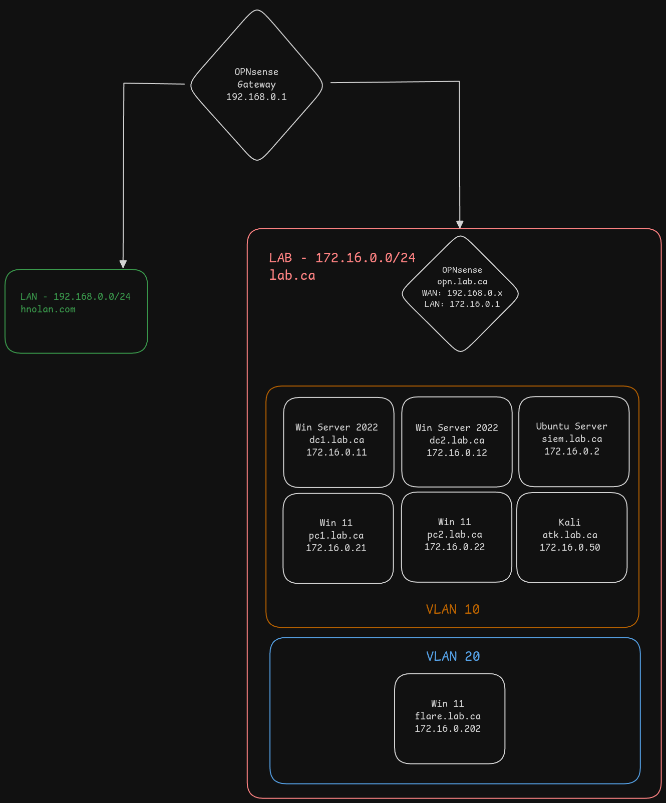

The OPNsense gateway at the top is our router to the Internet. On the left side in green, we have our real LAN with all our physical devices. On the right side, we have our lab network and its components. The lab network will be able to communicate with the OPNsense gateway to reach the Internet, but will not be able to communicate with the rest of our LAN network, and communication with the OPNsense gateway will be limited to traffic heading for the Internet. This is so that our malicious traffic is contained to the lab network and does not interfere with anything in our real LAN.

We will also have some segmentation within our lab network. We'll use two VLANs, one for our mini enterprise network and one for our analysis machines. This isn't as important as the separation between our real LAN and our lab network, but the analysis machines simply aren't our targets for the attacks.

Our lab network will have the following devices:
- **OPNsense**
  - Gateway to WAN for the lab devices
  - Will employ firewall rules and IDS/IPS (Suricata)
- **Ubuntu Server**
  - Running ELK stack for security monitoring
  - I will most likely eventually decide to scale this VM up and add more software, such as Arkime for viewing packets. I will also probably explore SIEM options apart from ELK at some point. But for now, the plan is just ELK.
- **Windows Server 2022** x2
  - We will set up an Active Directory environment with two Domain Controllers. Later in the process we will decide which services each DC will run.
- **Windows 11** x2
  - These will simulate workstations used by employees of the organization
- **Kali Linux**
  - Adversary machine launching attacks
- **Windows 11**
  - Running Flare-VM for reverse engineering

**Note:** I will be using Proxmox for the hosting of all VMs. This is not a Proxmox tutorial, and as such I will assume that if you are following along, you are comfortable working with Proxmox.

## Software

### OPNsense

I dislike pfSense for two reasons: the whole drama with OPNsense in the past (which I won't get into here) and the web UI. For my use cases, pfSense and OPNsense are literally identical apart from the web UI. It's really just a GUI wrapper for a variety of different services - we could configure all the same services by hand in the terminal - but that would take much more time, and distract from the actual learning goal of this lab.

I may eventually choose to take a look at VyOS though. I heavily prefer CLI interaction to GUIs, so it seems appealing. Additionally, it has a lot more functionality as a pure router than OPNsense does.

### ELK

"Elastic" or "ELK" is a combination of three tools: Elasticsearch, Logstash, and Kibana (E, L, K). The gist is that Elasticsearch is a data search engine and Kibana is the front end data visualization part that we actually use. Logstash can be used to parse and transform log data during log ingestion. An ELK stack can be used to collect just about any type of data, and has tons of third party integrations. It is a really great option for a free and open source SIEM.

*However*, it's not actually completely free - many features are locked behind the enterprise license. *Double however*, you get a free trial for 30 days, and you can reset the trial period simply by running `sudo docker compose down -v` to remove the existing containers and their volumes, and then executing the startup commands seen below (just the `docker compose` ones). This isn't really an issue for our lab because we don't care about long term data. There are some configurations we'll want to keep though (for instance installed plugins, created dashboards). We can export these before deleting the containers and data, then import them once we start it back up again.

Later down the road, depending on how things are performing, I may take Logstash out of the stack. It probably won't be getting used much, if at all.

## Downloading ISOs

First things first we need to download all the required VM images. Grab the download links from the following:

- [OPNsense](https://opnsense.org/download/) - use `dvd` image type
- [Ubuntu Server](https://ubuntu.com/download/server/thank-you?version=24.04.1&architecture=amd64&lts=true) - copy the `download now` link
- [Kali](https://www.kali.org/get-kali/#kali-installer-images)
- [Windows 11](https://go.microsoft.com/fwlink/p/?linkid=2195682&clcid=0x409&culture=en-us&country=us) - fill out the form and download the ISO; does not need to be real information
- [Windows Server 2022](https://info.microsoft.com/ww-landing-windows-server-2022.html) - same as above
- [VirtIO Drivers](https://pve.proxmox.com/wiki/Windows_VirtIO_Drivers) - copy the `download latest stable` URL
  - These are required for Windows to work with VirtIO hard drives

## VM Configuration

I won't go in depth on the process of creating each VM, but I'll provide links and things you should be aware of.

### OPNsense

You can follow the [pfSense](https://docs.netgate.com/pfsense/en/latest/recipes/virtualize-proxmox-ve.html) guide for setting up this VM - pfSense and OPNsense are forks of the same project and their setup process is essentially identical. The only thing different for OPNsense is that you'll get better performance by using the q35 graphics card type.

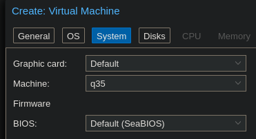

I am choosing to give my VM a 32gb drive, 4 CPU cores, and 4gb of RAM.

Once you have gone through the VM creation wizard, make sure you go into the Hardware settings and add the second bridge interface to the VM.

Watch the VM while it's booting up; eventually you will see `Press any key to start the manual interface assignment`. Press a key to trigger this. Press `n` when it asks if you want to configure LAGGs or VLANs. Use `vtnet0` for the WAN interface and `vtnet1` for the LAN interface.

When you see the login screen, log in as `installer` with password `opnsense`. Follow the configuration wizard to set up the system keymap and create the filesystem. When the wizard is complete, set a new root user password. The VM will now reboot.

When the reboot is done, both our interfaces should have IP addresses. Assuming you are running DHCP on your router (if you aren't, why?) the WAN interface will receive an IP address in the LAN. We can leave this as-is. Enter option `2` to set the LAN interface IP.  Use the IP address `172.16.0.1` and a subnet mask of `24`. Also, enter `y` to enable the DHCP server on this VM. The start and end addresses don't really matter - as long as you leave enough room to support our 6 devices. We will eventually be setting static DHCP leases for all these devices anyway, so the IPs they are assigned by DHCP really do not matter.

Now we must pause and set up our other VMs before we can continue. This is because we currently don't have a way to access the OPNsense web GUI. Once we set up our Windows VMs, we will have a desktop environment that we can use to connect to the web GUI.

### Ubuntu

I will be giving this VM a 64gb drive, 8 CPU cores, and 8gb of RAM.

The only real setting we need to change in the creation wizard is the network interface; make sure the **second** bridge is selected, i.e. the one we manually created. Otherwise, the VM will be on your LAN network.

Once the VM is booted, the setup process is very straightforward. I will be using the following options:
- Minimized installation
- SSH server enabled
- The following IPv4 configuration:
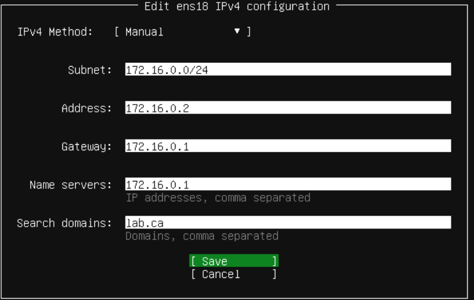
- Hostname will be `siem`

### Kali

This VM will get a 50gb drive, 8 CPU cores, and 8gb of RAM. Remember to pick our new bridge for the interface. When going through the setup wizard, set the domain to `lab.ca`.

### Windows Server

We will create one VM, go through the installation process, then shut it down and clone it so we don't have to do that process twice. The set up of Windows VMs is a little more complex than Linux VMs, but Proxmox provides a [best practices](https://pve.proxmox.com/wiki/Windows_2022_guest_best_practices) guide that walks you through the process.

I will be giving this VM a 64gb drive, 4 CPU cores, and 8gb RAM. Like with the Ubuntu VM, make sure you select `vmbr1` for the network interface.

Start the VM and go through the first couple steps of the installation wizard.

Choose one of the OSes with a desktop environment:

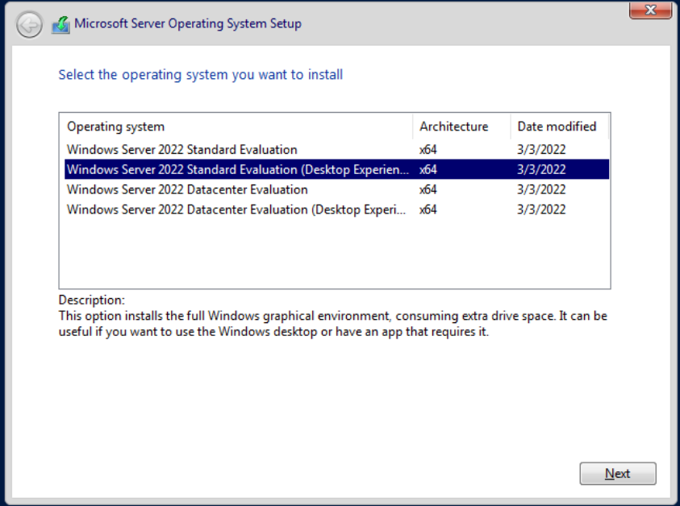

When it asks you `Which type of installation do you want?`, choose `Custom: Install Microsoft Server Operating System only (advanced)`. Press the `Load driver` button:

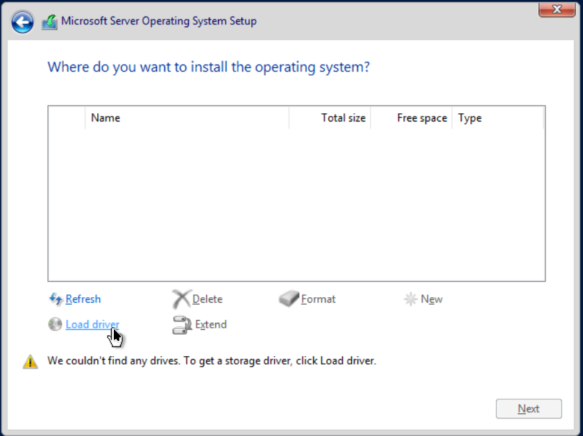

Our VirtIO drivers should be found automatically. Press next. Once the drivers are installed, our VirtIO hard drive should be visible in the configuration wizard.

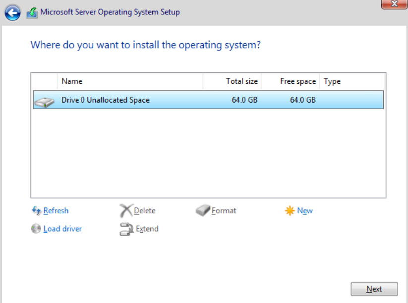

Click `New` and use the defaults, then press next.

When the installation process is finished, set a new Administrator password and log in. Open up File Explorer and navigate to wherever our VirtIO CD was mounted. Navigate to the `guest-agent` folder and run the applicable installer for your hardware. Then, exit that directory and  run `virtio-win-guest-tools`. Finally, reboot the VM to finish the installation, then shut it down and clone it so we have two Windows Server VMs.

### Windows 11

First things first, create *two clones* of your Windows 11 VM ***before powering it on.*** Running Sysprep won't be possible without some tedious workarounds, so if we try to install Windows and clone after, we'll run into issues. It's less annoying to just go through the Windows setup process twice.

The Windows 11 VM creation process is almost identical to the Windows Server process. The [best practices guide for Windows 11](https://pve.proxmox.com/wiki/Windows_11_guest_best_practices) is identical to the Windows Server guide.

I'll be giving this VM a 64gb drive, 4 CPU cores, and 4gb RAM. Once again, ensure you select our newly created bridge for the network interface.

The installation wizard process is essentially the same, but the VirtIO driver loading is a little bit different. The relevant drivers won't be found automatically, so we will need to browse for them. The below screenshot shows the correct location to select.

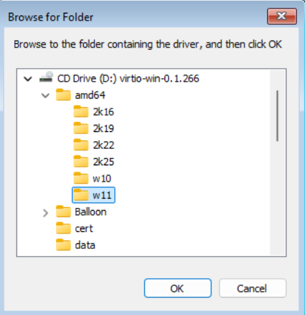

Eventually you will come to the Windows setup wizard. On the network screen we'll install the VirtIO network driver. Click `Install driver`, navigate to where the VirtIO ISO was mounted, then to `NetKVM -> w11 -> amd64` and press select. Don't worry if it says 'no network drivers found' - it finds them. I have no idea why it says it doesn't.

When it asks you to sign in via a Microsoft account, choose `Sign-in options` and press `Domain join instead`.

Once the installation is finished and you can log in, install the VirtIO guest tools again via File Explorer, the same way we did on Windows Server.

Finally, reboot the VM, and repeat this process on PC2.

### Flare-VM

First, go through the Windows installation process like we did on PC1 and PC2, but don't join the domain. Follow the relevant Flare-VM [pre-installation steps](https://github.com/mandiant/flare-vm?tab=readme-ov-file#pre-installation). Before continuing, we will change this VM's DNS server - it will have set its DNS server to DC1 via the DHCP lease, but this VM will not be able to reach DC1 eventually.

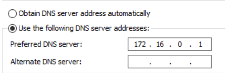

Next, follow the [installation instructions](https://github.com/mandiant/flare-vm?tab=readme-ov-file#flare-vm-installation) to set up all the tools. Do note that the install script will take quite a while to execute.

---

# Software setup and environment initialization

So we now have all our VMs created, but we aren't done the setup process yet. In this section, we will:

- Configure OPNsense DHCP so all our devices receive the proper domain name and DNS server
- Set up Active Directory and turn our Windows Server VMs into domain controllers
- Join our Windows 11 PCs to the Active Directory domain
- Set up ELK on our Ubuntu VM

## Active Directory

### Promoting DC1

Power on DC1 and log in. First things first, we need to set a static IP address on this DC - I'll be using `172.16.0.11` - set the gateway and DNS server to `172.16.0.1`.

Server Manager should open automatically; once it does, press `Add roles and features`. Press next until you are at the `Server Roles` menu. For now, just pick `Active Directory Domain Services` and `DNS Server`. Alternatively, if there are other service roles that you know you'd like to install, you can install them now as well.

Once installation is finished, you'll see a notification prompting you to promote the server to a domain controller.

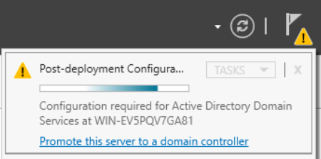

Select this and the AD DS configuration wizard will open. Select `Add a new forest` as the deployment operation, with the root domain name `lab.ca`. Change the NetBIOS name to `LAB`. Press `Install` at the end of the wizard. The installation process will take at least a few minutes. When it's finished, open up a web browser on DC1 and navigate to `https://172.16.0.1` to reach the OPNsense web GUI.
### OPNsense DHCP Configuration

You can go through the configuration wizard, setting the OPNsense VM's hostname and domain name. Set the DNS server to `172.16.0.11`.

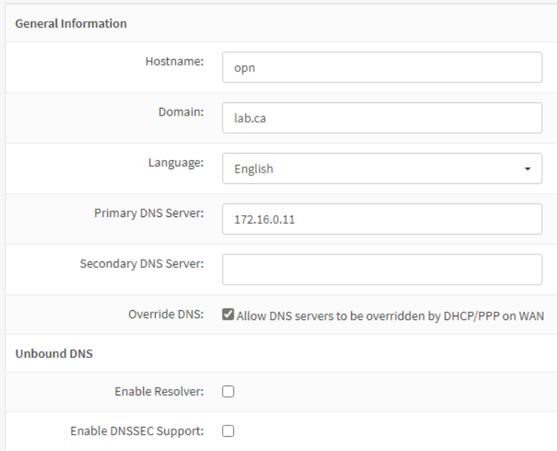

On the WAN interface options page, **uncheck** the `Block RFC1918 Private Networks` option.

When you are finished with the wizard, go to `Services -> ISC DHCPv4 -> [LAN]`. Set the DNS server, gateway, and domain name as follows.

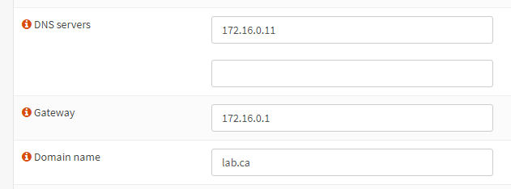

Before we move on, let's change the machine name to DC1. In Server Manager, click `Local Server` on the left side. Click on the computer name, which will open System Properties. Press `Change`. You will see a warning because we are doing this after setting up AD DS, but it's fine because none of our other hosts are using AD yet. Set the computer name to DC1 and reboot the VM.

### Promoting DC2

Now, log in to DC2. Open Command Prompt and run `C:\Windows\System32\Sysprep\sysprep.exe`. The Sysprep GUI will open; check the `Generalize` option.

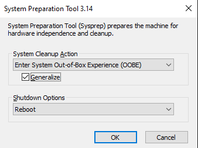

This step is vital because you will not be able to promote this server to a DC without running Sysprep. Because we cloned the DC1 VM, some of the system information is the exact same. Namely, the [SID](https://learn.microsoft.com/en-us/windows-server/identity/ad-ds/manage/understand-security-identifiers) will be the same, which will prevent this server from joining the domain. Running Sysprep will remove any computer-specific information, like the SID.

After that, follow the same process we did on DC1 to change the machine name. Name the machine `DC2` and also select the `Domain` option to join it to the domain.

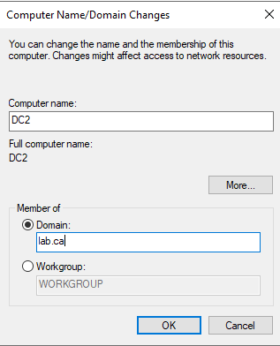

After pressing `OK`, you will be prompted to enter credentials; use `LAB\Administrator` and whatever password you set, then reboot the VM. When at the login screen, press `Other user` and log in as the `LAB\Administrator` user.

Next, still on DC2, set a static IP like we did on DC1; I'll be using `172.16.0.12`. However, instead of setting the DNS server to our OPNsense IP, set it to the DC1 IP, `172.16.0.11`.

Then, in Server Manager, press `Add roles and features` again. This time we'll only add `Active Directory Domain Services`. Once it installs, promote the server to a DC. This time, use the `Add a domain controller to an existing domain` deployment operation. Set the domain to `lab.ca`. If you logged in as the local `Administrator` user instead of `LAB\Administrator`, you'll need to enter credentials: use the username `LAB\Administrator` and whatever password you set.

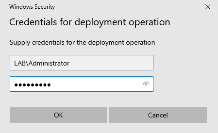

### Joining PCs to the Domain

Now we just need to join our PCs to the domain. However, first we need to create the users for each PC on one of the DCs - it doesn't matter which. I will be creating the users `Hayden Nolan` and `Nolan Hayden` for use on each PC.

In Server Manager, open the `Tools` dropdown menu from the navbar towards the right side. Choose `Active Directory Users and Computers`. Expand the dropdown menu for `lab.ca` on the left side, right click `Users`, and select `New -> User`.

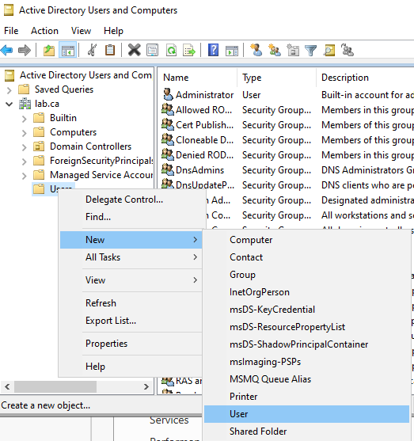

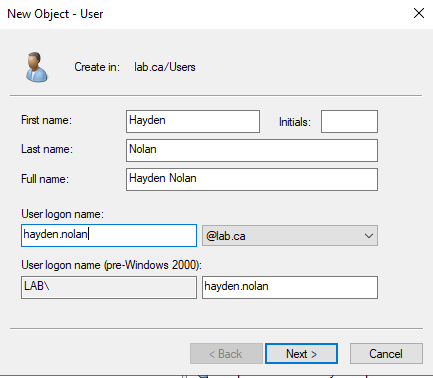

Repeat for the second user.

Next, log into either Win11 VM (process will be identical on both), press the Windows key, and search for `Access work or school`. Click the `Connect` button to add a new account. Click the Active Directory option, and enter `lab.ca` as the domain to join. When prompted, enter the same `LAB\Administrator` credentials we have used previously.

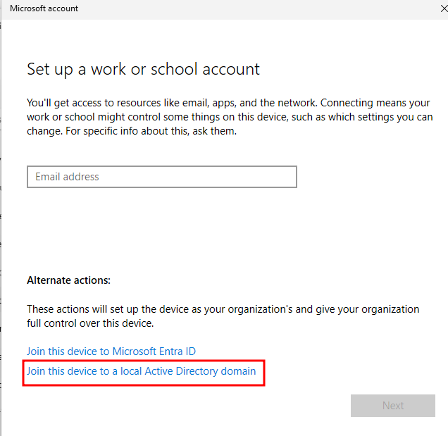

Note: if you get an error about not being able to find the domain, open command prompt and enter `ipconfig /release` followed by `ipconfig /renew` - this will release our old DHCP lease and request a new one. This may be necessary depending on the order of operations you took - if your VM got a DHCP lease before we set the domain and DNS settings in OPNsense, it won't be able to contact the DC.

You will be prompted to add a new user account for this PC. Use one of the two users we created on the DC previously, then restart the VM. Repeat the process on the other PC, using the other user account.

## Elastic

Log into our Ubuntu Server VM and run the following to easily deploy an ELK stack:
```bash
sudo apt update && sudo apt upgrade -y
curl -fsSL https://get.docker.com -o get-docker.sh
sudo sh ./get-docker.sh

git clone https://github.com/deviantony/docker-elk && cd docker-elk
sudo docker compose up setup
pw=$(openssl rand -hex 32)
echo "xpack.security.encryptionKey: \"${pw}\"" >> kibana/config/kibana.yml
echo "xpack.encryptedSavedObjects.encryptionKey: \"${pw}\"" >> kibana/config/kibana.yml
echo "server.publicBaseUrl: \"http://siem.lab.ca:5601\"" >> kibana/config/kibana.yml
sudo docker compose up -d
```

Now log onto DC1. We'll create a DNS record so we can access the Kibana web UI via the URL in the config commands above.

Open the `Tools` dropdown menu from the Server Manager navbar and select `DNS`. In the DNS Manager window, expand the dropdowns on the left side: `DC1 -> Forward Lookup Zones`. Right click `lab.ca` and select `New Host (A or AAAA)...`.

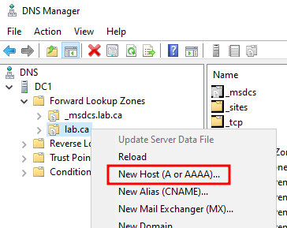

Enter the name `siem` and the IP `172.16.0.2`, which we configured during the VM installation, and click `Add Host`. Now, if you visit `http://siem.lab.ca:5601` in the browser of any of our Windows machines, you will see the Kibana login screen. The default login credentials are `elastic:changeme`.

Note: you might see this error. This is caused by an out of date browser - you can either update Edge or download the latest version of any other browser.

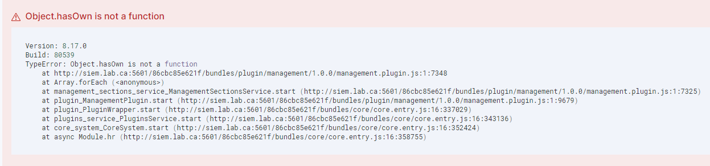

---

And that's it for now. I strongly recommend creating a snapshot of each VM at this point. This will be our base configuration point that we can always restore to in the future in case anything breaks. Stay tuned for the next post where we'll set up all of our network isolation as well as dig a bit deeper into Elastic and get all our endpoints monitored.
