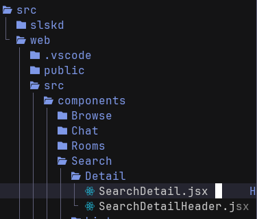
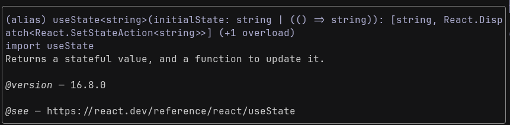
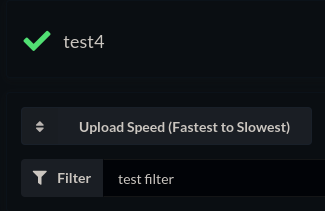
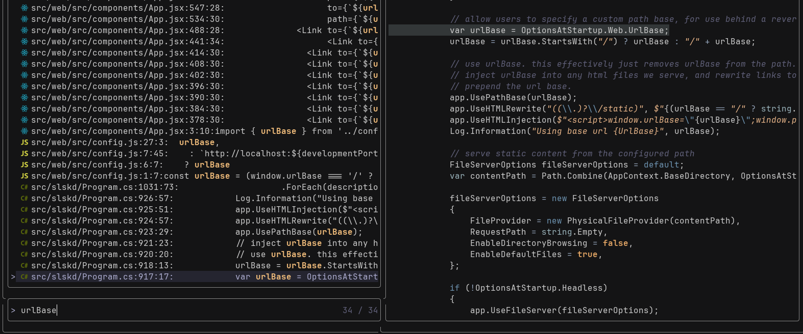
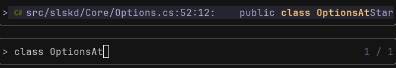
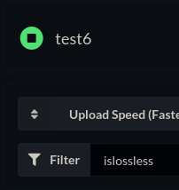
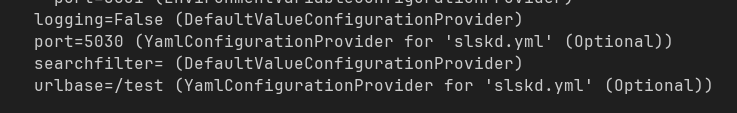
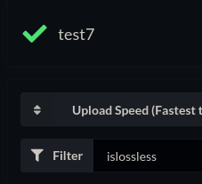

Soulseek is a very cool peer-to-peer file sharing network. Unfortunately, its official desktop client isn't the best, so many people, including myself, use an alternative like Nicotine+. However, it would be nice to be able to access Soulseek from any device I want without having to install Nicotine+ on each one, so I sought out a web alternative. There are projects that simply serve the exact same desktop app in the browser through things like VNC, but I prefer something built with the web in mind.

Slskd is a project that provides a web UI that acts as the client talking to the backend Soulseek service. It's a great project, and exactly what I am looking for, but is missing one feature that I love in Nicotine+: default search result filters.

I only want to download lossless files, so in Nitocine+ I have the default filter set to FLAC files only. You can filter the results in Slskd with `islossless`, but there is no way to save that as a default, so I would need to type it for every search. I listen to/download a *lot* of music, so this would be extremely tedious.

Thankfully, the project is open source on GitHub. However, there's a problem: It is a .NET app using React for the frontend, and I am not familiar with either of these technologies.

That is what this post is about. I am going to attempt to add this as a feature without knowing how either of these things work. My hope is to show that contributing to open source projects can sometimes be pretty easy, even if you have no clue what you're doing.

---

I started by forking the repository, cloning my fork, and creating a new branch for the feature. I already know that the configuration for this feature will happen in the global config file, but I am not sure how the code uses that file yet. The first thing I want to figure out, though, is how the search filters work in the app.

I know that this filter is on the frontend only because of how searches work with Slskd. Your search is performed fully before you have the opportunity to apply any filters, which implies that the filter is not passed to the Soulseek backend. We are just filtering all results that were returned by the backend. Taking a look at the repository's layout, I can see that the frontend code is in `src/web`, and after a bit of poking around I was able to find the file where the filters are applied.



The filter you enter in the web UI is simply passed to the code as a string:
```javascript
const [resultFilters, setResultFilters] = useState('');
...
const filters = parseFiltersFromString(resultFilters);

```

I can tell that resultFilters is being defined, but I am not sure what exactly `useState` does, so I view the function signature:



Okay, makes sense, and gives me an idea; if I can get a string value from the config file into JavaScript, I can use that value to set the default filter here. Let's test that theory by making a simple change:
```javascript
const [resultFilters, setResultFilters] = useState('test filter');
```

We can now build the Docker image, launch the app, make a search, and see if there is a preapplied filter saying "test filter".



It works!

So now I need to figure out how the app actually uses the config values. I know that there are other web config options already; how are they passed into the app?

Looking at `src/web/src/config.js` I can see that the config options are being grabbed using `window.<option>`:
```javascript
const urlBase = (window.urlBase === '/' ? '' : window.urlBase) || '';
const developmentPort = window.port ?? 5_030;
```

This confused me; [Window](https://developer.mozilla.org/en-US/docs/Web/API/Window) in JavaScript basically represents the literal browser window. How are these properties being assigned to it?

I search for `urlBase` throughout all files in the project and notice this section in `Program.cs` in the backend code:



Then I notice the following line:
```cs
app.UseHTMLInjection($"<script>window.urlBase=\"{urlBase}\";window.port={OptionsAtStartup.Web.Port}</script>", excludedRoutes: new[] { "/api", "/swagger" });
```

This is where our config values are being injected into the React app. I will need to mentally bookmark this spot and come back to it.

Now I need to figure out where `Program.cs` got the `urlBase` value from. It is defined a few lines above with:
```cs
var urlBase = OptionsAtStartup.Web.UrlBase;
```

Now I need to follow this `OptionsAtStartup.Web` object, so I search for its declaration:



It contains the following useful information:

```c
<para>
    This class contains all application options, which may be sourced from (in order of precedence):
    <list type="bullet">
        <item>
            <term>Defaults</term>
            <description>Default values, statically defined in this class.</description>
        </item>
        <item>
            <term>Environment Variables</term>
            <description>Environment variables set at either the system or user scope.</description>
        </item>
        <item>
            <term>YAML Configuration File</term>
            <description>A YAML file containing a mapping of this class.</description>
        </item>
        <item>
            <term>Command Line</term>
            <description>Options provided via the command line when starting the application.</description>
        </item>
    </list>
</para>
```

The relevant section for the web options:

```c
/// <summary>
///     Gets options for the web UI.
/// </summary>
[Validate]
public WebOptions Web { get; init; } = new WebOptions();
```

Now we need to look at the declaration of `WebOptions`:

```c
/// </summary>
public class WebOptions
{
    ...
    /// <summary>
    ///     Gets the base url for web requests.
    /// </summary>
    [Argument(default, "url-base")]
    [EnvironmentVariable("URL_BASE")]
    [Description("base url for web requests")]
    [RequiresRestart]
    public string UrlBase { get; init; } = "/";
    ...
```

At this point I thought this might be enough to get everything working, so I started making additions. I added the following to `WebOptions` above:

```c
    /// <summary>
    ///     Gets the value of the default filter to use for search results.
    /// </summary>
    [Argument(default, "search-response-filter")]
    [EnvironmentVariable("SEARCH_RESPONSE_FILTER")]
    [Description("string to use as default filter for search results")]
    public string SearchFilter { get; init; } = string.Empty;
```

Then, back in `Program.cs` I injected this value:
```c
app.UseHTMLInjection($"<script>window.urlBase=\"{urlBase}\";window.port={OptionsAtStartup.Web.Port};window.defaultFilter=>\"{OptionsAtStartup.Web.SearchFilter}\";</script>", excludedRoutes: new[] { "/api", "/swagger" });

```

Next, I exported it as a global JavaScript variable in `config.js`:
```javascript
const defaultFilter = window.defaultFilter ?? '';

export {
  ...
  defaultFilter,
  ...
}
```

Now, in `SearchDetail.jsx`:

```javascript
import { defaultFilter } from '../../../config';
...
const [resultFilters, setResultFilters] = useState(defaultFilter);
```

And finally, update `config.example.yml` to include our new value:

```yml
# web:
#   default_filter:
```

Now let's build the Docker image again and try it out. After launching the new Docker image once, we can modify the config file.

```yml
web:
  default_filter: islossless
```

Now let's see if that worked...


It did not. Okay, reading from the config file is not working, but does it work if we set the value as an environment variable? Recall that this is one of the ways the configuration values can be set as we learned earlier. I will test this by setting the environment variable in my `docker-compose.yml`:

```yml
environment:
  - SLSKD_SEARCH_RESPONSE_FILTER=islossless
```

This works properly:



Strange. At this point, I turned on debug mode so I could see the config as Docker sees it:



Values that are set show `(YamlConfigurationProvider for 'slskd.yml' (Optional))`, but the search filter value does not show that. I double checked everything and realized that it was a naming issue; in `Options.cs` I had called this `SearchFilter`, but in  the config file I called it `default_filter`. I do not know the specifics, but I guess to match values from the YAML file, .NET turns their keys into strings with underscores/dashes removed and compares them to the variable name, case insensitive. So I just had to change the value in the YAML file to `search_filter`. Now it works!



Hooray, we have successfully made our change. Now it's time to contribute these changes upstream by opening a [pull request](https://github.com/slskd/slskd/pull/1412).
